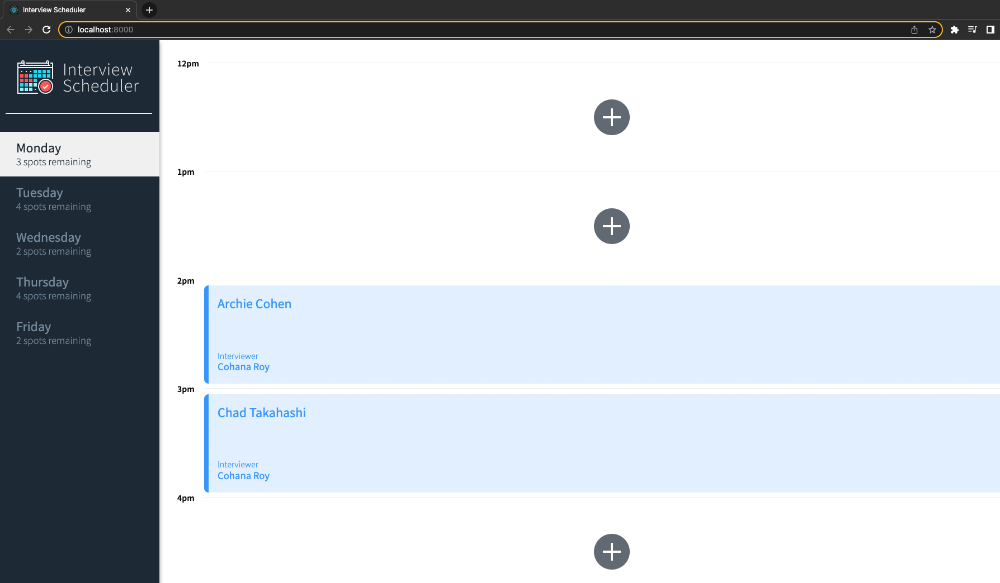
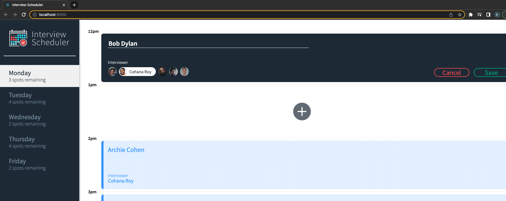
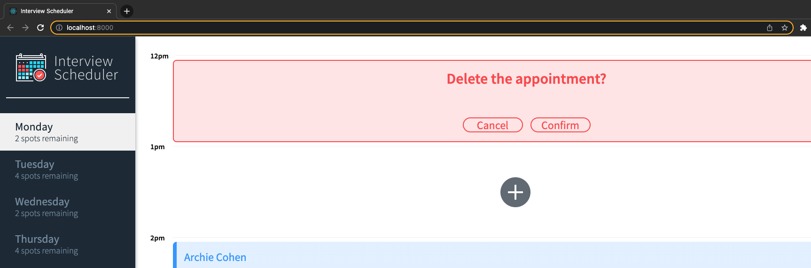
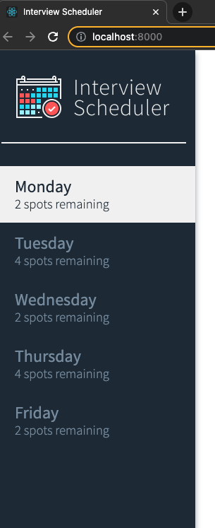

# Interview Scheduler
Scheduler is a basic application created for LightHouseLabs.ca ReactJS, StoryBook, Jest and Cypress for testing

## Screenshots

### Main Page


### Add/Edit Appointments


### Delete Appointments



### Select Day of the Week and show Spots remaining


## Setup

Install dependencies with `npm install`.

## Running Webpack Development Server

```sh
npm start
```

## Running Jest Test Framework

```sh
npm test
```

## Running Storybook Visual Testbed

```sh
npm run storybook

Visit http://localhost:8000/ in your web browser to start Scheduler app.
```

## Features...
- create, add, edit and delete scheduled interviews through any of the days
- jump to different day of the week through the left sidebar

## Dependencies
- Node.js
- PostgreSQL
- SCSS (CSS)
- ReactJS
